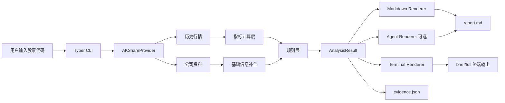

# shuoha


`shuoha` 是一个面向投资小白的 A 股分析 CLI。  
你输入一个 6 位股票代码，它会输出一份中文研究报告，先给结论，再解释理由、风险、观察点和新手最容易犯的错。

仓库文档：

- [README.md](/Users/leeeeeee/code/shuoha/README.md)
- [CONTRIBUTING.md](/Users/leeeeeee/code/shuoha/CONTRIBUTING.md)
- [CHANGELOG.md](/Users/leeeeeee/code/shuoha/CHANGELOG.md)
- [LICENSE](/Users/leeeeeee/code/shuoha/LICENSE)

当前用户入口：

macOS:

```bash
curl -fsSL https://raw.githubusercontent.com/synctoai/shuoha/main/scripts/install.sh | sh
```

Windows:

```powershell
irm https://raw.githubusercontent.com/synctoai/shuoha/main/scripts/install.ps1 | iex
```

安装完成后，直接运行：

```bash
shuoha analyze 600519
```

## 面向用户

### 它解决什么问题

大多数股票工具的问题不是“信息不够多”，而是“信息很多，但新手还是看不懂”。  
`shuoha` 的目标不是替你下单，而是把技术面和风险面翻译成小白也能读懂的话。

它当前会重点回答这些问题：

- 现在更适合 `可以关注`、`观望`，还是 `暂时回避`
- 做出这个判断的主要依据是什么
- 当前最大的风险在哪里
- 接下来应该盯什么信号，而不是盲目冲进去

### 适合谁

- 刚开始看 A 股、能认股票代码但看不懂指标的人
- 想快速扫一只股票，但不想直接打开一堆财经 App 的人
- 希望先看中文解释，再决定要不要继续深挖的人

### 不适合谁

- 需要财报深度建模、估值模型、组合优化的专业投资者
- 想直接拿一个“买入指令”替代独立判断的人
- 需要港股、美股、基金、期货支持的人

### 快速开始

macOS 一行安装：

```bash
curl -fsSL https://raw.githubusercontent.com/synctoai/shuoha/main/scripts/install.sh | sh
```

Windows 一行安装：

```powershell
irm https://raw.githubusercontent.com/synctoai/shuoha/main/scripts/install.ps1 | iex
```

安装完成后，直接分析：

```bash
shuoha analyze 600519
```

如果你只是普通用户，到这里就够了。

### 升级与卸载

升级到最新版本：

```bash
curl -fsSL https://raw.githubusercontent.com/synctoai/shuoha/main/scripts/install.sh | sh
```

安装指定版本：

```bash
curl -fsSL https://raw.githubusercontent.com/synctoai/shuoha/main/scripts/install.sh | sh -s -- --version v0.1.0
```

卸载：

macOS:

```bash
curl -fsSL https://raw.githubusercontent.com/synctoai/shuoha/main/scripts/uninstall.sh | sh
```

Windows:

```powershell
irm https://raw.githubusercontent.com/synctoai/shuoha/main/scripts/uninstall.ps1 | iex
```

### 开发者启动方式

如果你准备参与开发，而不是单纯使用 CLI，再看这部分。

环境要求：

- Python `3.12+`
- `uv`

安装依赖：

```bash
uv sync --extra dev
```

运行分析：

```bash
uv run shuoha analyze 600519
```

默认会在终端显示一张短摘要卡片，并将完整产物写入：

```text
out/600519/report.md
out/600519/evidence.json
```

### 终端使用方式

默认摘要模式：

```bash
shuoha analyze 600519
```

完整终端报告模式：

```bash
shuoha analyze 600519 --full
```

显式使用摘要模式：

```bash
shuoha analyze 600519 --brief
```

自定义输出目录：

```bash
shuoha analyze 600519 --output-dir ./tmp/600519
```

### 外部 CLI 深度分析

默认本地模式仍然是确定性分析：

```bash
shuoha analyze 600519 --cli local
```

如果本机已安装并登录 Codex CLI，可以让 `shuoha` 复用 AKShare 和本地指标结果，再交给 Codex 继续研究新闻、公告、资金流、舆情和行业催化：

```bash
shuoha analyze 000657 600105 300260 --cli codex
```

`--cli codex` 会生成一份多股票决策仪表盘报告，并写入 `out/codex/<date>/report.md`。

### 输出内容说明

终端默认会先显示 4 个最关键的问题：

- `结论`
- `最大理由`
- `最大风险`
- `下一步`

完整 Markdown 报告会包含这些核心部分：

- `电梯摘要`
- `快速结论`
- `锐评`
- `证据判决书`
- `为什么先别急着买`
- `接下来盯什么`
- `新手最容易犯的错`
- `这份报告最可能看错的地方`
- `指标翻译`

### 示例输出

默认摘要模式大概长这样：

```text
================ 电梯摘要 ================
[结论] 观望
[最大理由] 价格站在 20 日和 60 日均线之上，短中期趋势暂时偏强。
[最大风险] 距离高点回撤较深，需要更谨慎。
[下一步] 如果后续量能明显改善，而且价格还能继续站稳关键均线，上涨态度才更像是真的。
======================================
已生成 out/600519/report.md
已生成 out/600519/evidence.json
```

`--full` 模式会把完整报告直接打印到终端，风格更接近“终端研究卡片”：

```text
================ 股票报告 | 贵州茅台（600519） ================

[快速结论]
结论：观望

[锐评]
趋势和动量看着不丑，但量能没跟上，你现在冲进去，更像是在替别人接情绪。

[证据判决书]
- 利多：2 条
- 利空：1 条
- 中性：3 条
- 证据总分：1
```

完整长文仍然会写入 `out/<stock_code>/report.md`，终端只是便于快速扫读。

### `evidence.json` 是干什么的

`report.md` 给人看，`evidence.json` 给机器看。

`evidence.json` 里会保存：

- 标准化后的结论和置信度
- 技术证据和风险证据
- 数据状态和不确定项
- 公司基础信息

这让后续扩展变得简单，比如：

- 做前端页面
- 做批量分析
- 做 thesis/watch 模式
- 接入不同模型生成不同风格解释

### Agent 模式

如果你希望用 LLM 对确定性结果做一次“文风改写”，可以开启 `--agent`。

安装可选依赖：

```bash
uv sync --extra dev --extra agent
```

配置环境变量：

```bash
export OPENAI_API_KEY=你的密钥
```

运行：

```bash
shuoha analyze 600519 --agent
```

说明：

- `--agent` 当前只负责把已有证据改写成更自然的中文 Markdown
- 它不负责生成底层证据
- 它不应该修改 deterministic verdict
- 没有 `OPENAI_API_KEY` 或当前运行环境没有 `openai` 依赖时，系统会回退到本地 renderer
- 面向普通用户的预编译 release 默认优先保证确定性主链路，`--agent` 更适合源码安装或开发者环境

### 免责声明

`shuoha` 不是投顾，不提供投资建议。  
它的目标是帮助新手“看懂一只股票现在大概是什么状态”，不是替你做交易决策。

### 项目状态

当前项目状态是 `MVP`。

这代表：

- 主链路已经可用
- 文档、测试、产物格式已经成型
- 适合继续迭代，不适合宣称“生产级投顾系统”

当前包版本见 [pyproject.toml](/Users/leeeeeee/code/shuoha/pyproject.toml) 中的 `0.1.0`，变更记录见 [CHANGELOG.md](/Users/leeeeeee/code/shuoha/CHANGELOG.md)。

## 面向技术

如果你准备参与开发，先看 [CONTRIBUTING.md](/Users/leeeeeee/code/shuoha/CONTRIBUTING.md)。

### 当前技术栈

- `Python 3.12+`
- `Typer`
  - CLI 入口和参数解析
- `Rich`
  - 终端渲染
- `Pydantic`
  - 结构化 schema 和 `evidence.json`
- `AKShare`
  - A 股数据抓取
- `pandas`
  - 数据表处理
- `OpenAI` 可选
  - `--agent` 模式下的报告改写
- `pytest`
  - 单元测试
- `uv`
  - 依赖和运行时管理

### 架构原则

这个项目不是“让模型自由发挥的股票聊天机器人”。  
主链路是一个证据优先的确定性分析管线：

1. provider 拉取并标准化 A 股历史数据和公司资料
2. 指标层计算 `MA`、`MACD`、`RSI`、`量能比`、`波动`、`回撤`
3. 规则层根据证据数量和 veto 条件给出 `verdict / confidence / bias`
4. renderer 把结构化证据转成中文 Markdown 和终端输出
5. output 层落盘 `report.md` 和 `evidence.json`

核心原则：

- LLM 可以润色表达，但不能替代底层证据
- verdict 必须来自确定性规则，而不是 prompt 幻觉
- CLI 默认优先服务投资小白，而不是专业交易员

### 数据流图



读图方式：

- 左边是输入和数据源
- 中间是 deterministic 分析主链路
- 右边是给人看的终端/Markdown 输出，以及给机器用的 `evidence.json`
- `Agent Renderer` 是可选分支，不是主判决引擎

### 数据来源和缓存策略

当前 provider 是 `AKShareProvider`，主要依赖 `AKShare`：

- 历史行情优先走 `stock_zh_a_hist`
- 失败时回退到腾讯历史接口 `stock_zh_a_hist_tx`
- 公司资料优先走 `stock_profile_cninfo`

本地缓存目录：

```text
.cache/shuoha/provider/
```

当前缓存策略：

- 历史数据和公司资料分别缓存
- 默认 TTL 为 `6 小时`
- 历史行情和公司资料会并发抓取

### 目录结构

```text
src/shuoha/
  __main__.py                    # python -m shuoha / 打包入口
  cli.py                         # Typer CLI 入口
  engine.py                      # 分析主流程
  indicators.py                  # 技术指标计算
  rules.py                       # verdict / confidence / bias 规则
  schemas.py                     # Pydantic schema
  config.py                      # 默认输出和缓存目录
  data/providers/
    base.py                      # provider payload 抽象
    akshare_provider.py          # 当前 A 股 provider
  reporting/
    markdown_renderer.py         # 写入 report.md 的 Markdown renderer
    terminal_renderer.py         # brief/full 终端展示 renderer
    agent_renderer.py            # 可选 LLM 改写层
    output.py                    # report.md / evidence.json 落盘

tests/
  test_akshare_provider.py
  test_cli.py
  test_distribution_contract.py
  test_engine.py
  test_indicators.py
  test_main.py
  test_markdown_renderer.py
  test_rules.py
  test_terminal_renderer.py

scripts/
  install.sh                     # macOS 一行安装脚本
  uninstall.sh                   # macOS 卸载脚本
  install.ps1                    # Windows 一行安装脚本
  uninstall.ps1                  # Windows 卸载脚本
```

### 本地开发

安装开发依赖：

```bash
uv sync --extra dev
```

运行测试：

```bash
uv run --extra dev pytest -v
```

查看 CLI 帮助：

```bash
uv run shuoha analyze --help
```

手动跑一个真实样例：

```bash
uv run shuoha analyze 600519
uv run shuoha analyze 600519 --full
```

### 分发与发布

面向用户的默认安装方式不是 `pip`、`uv` 或 `pipx`，而是下载预编译二进制。

当前 release 产物：

- `shuoha-darwin-amd64.tar.gz`
- `shuoha-darwin-arm64.tar.gz`
- `shuoha-windows-amd64.zip`

安装和卸载脚本说明见 [docs/distribution.md](/Users/leeeeeee/code/shuoha/docs/distribution.md)。

### 当前能力边界

当前已经支持：

- 6 位 A 股股票代码输入
- 中文终端摘要和完整报告
- `report.md` / `evidence.json` 双产物
- 基于 `MA / MACD / RSI / 量能 / 波动 / 回撤` 的确定性判断
- beginner-first 的中文解释层
- 可选 `--agent` 改写路径

当前还没有做：

- 股票名称搜索
- 多股票批量分析
- 港股 / 美股 / ETF / 基金支持
- 财报、估值、新闻情绪等更深层证据
- 真正的 DeepAgents 编排链路
- thesis/watch 持久化跟踪

### 设计取向

这个项目当前更像：

- 一个面向新手的股票解释器

而不是：

- 券商终端
- 高频策略平台
- 自动交易系统
- 让大模型自由编故事的“AI 投顾”

### 已知限制

- 结论只基于当前接入的数据源和规则，不代表股票真实内在价值
- 首次分析某只新股票时，耗时受远端数据源影响
- `--agent` 是可选增强，不应被视为更“正确”的结果
- 当前规则层仍然偏保守，适合新手学习，不适合激进交易

## Roadmap

更可能的下一步：

- 股票名称搜索和代码补全
- 更完整的公司基本面和估值信息
- 更稳的 provider/fallback contract
- watch/thesis 持久化跟踪
- 多角色输出，例如 `newbie / manager`
- 真正的 agent orchestration，而不是单纯改写层

## 版本与发布

当前版本策略：

- `MAJOR`
  - 不兼容的 CLI 或 schema 变更
- `MINOR`
  - 新功能、新输出段落、新 provider 能力
- `PATCH`
  - bugfix、文案修正、稳定性修复

建议发布前至少确认：

- `uv run --extra dev pytest -v`
- `uv run shuoha analyze 600519`
- 新 release 已生成预编译二进制
- README / CHANGELOG / CLI 帮助文本已同步

## 一句话总结

`shuoha` 不是帮你“自动买股票”的工具。  
它是一个把 A 股判断依据翻译成中文、尽量让投资小白也能看明白的 CLI。
